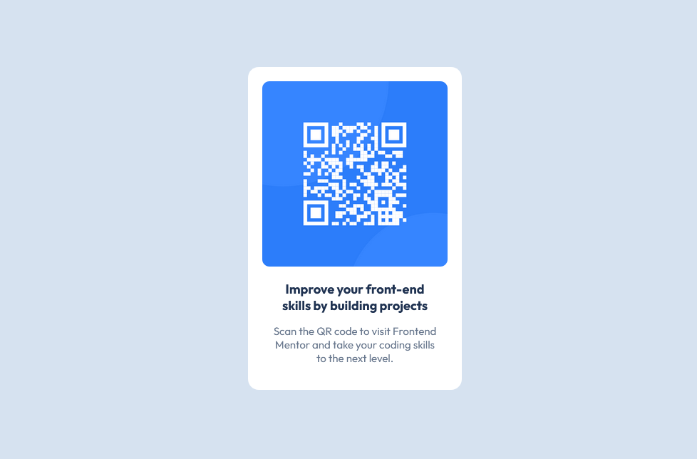

QR Code Component

This is my solution to the [QR Code Component challenge](https://www.frontendmentor.io/challenges/qr-code-component-iux_sIO_H) from Frontend Mentor.
## Overview
The challenge was to build a QR code component and make it look as close as possible to the provided design.

## Screenshot

## Built with
- HTML5
- CSS3
- Flexbox
- Google Fonts (Outfit)

## What I learned
Through this project, I practiced:
- Structuring a webpage with HTML
- Using CSS Flexbox to center content
- Working with `width`, `height`, `padding`, and `margin`
- Using `border-radius`
- Applying custom fonts with Google Fonts
- Using HSL colors
- Creating a simple card layout

## What I struggled with
One of the things I found challenging was controlling the spacing and positioning of the card and its content.
I also learned that small differences in padding, margin, and element sizes can affect the overall appearance of a layout.

## Continued development
I want to continue improving my understanding of CSS layout, especially:
- Box Model
- Flexbox
- Responsive design
- Spacing and sizing

## Author
Created by veefah as part of my front-end learning journey.
